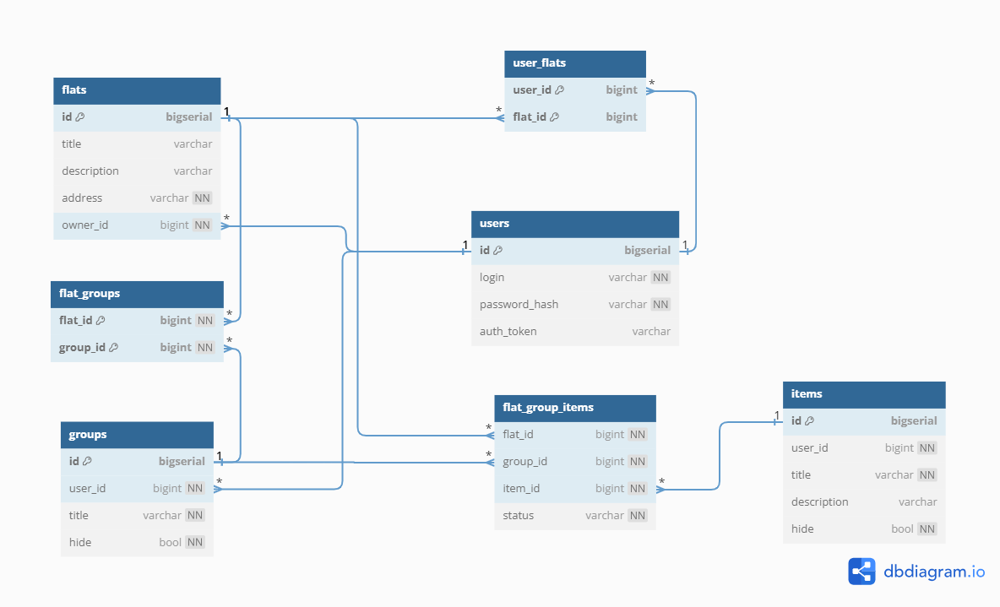

# Rent Check

Rent Check is an application that serves as a convenient checklist designed to simplify your apartment rental experience.

The app streamlines apartment choice by categorizing check items, allowing you to create groups within each flat based on necessity (_must-have_ and _optional_), room-specific criteria (_bathroom_ and _bedroom_), and any other preferences you desire.

In most cases, you confidently assess requirements, checking items like “not ground floor” for a second-floor apartment. In situations of uncertainty, such as when considering _pets allowed_ and a landlord permits cats but is unsure about dogs, Rent Check introduces a _meh_ option.

After inspecting all the apartments and marking your preferences, you'll have a consolidated list of potential flats, conveniently organized based on your specific criteria. This makes comparing apartments and reaching a final decision a simplified process.

## Table of contents

- [User Guide](#user-guide)
- [What's Next](#whats-next)
- [Implementation Details](#implementation-details)
- [Development Team](#dev-team)

## User Guide 

### Register & Login

To register and log in, enter your username and password.

Note that currently, our app supports only one authentication method (refer to Bearer Authentication for details).

### Add Flat

Click the `+` button to add a flat. Provide the mandatory address and, optionally, a title and description. Upon completion, you'll be redirected to a dedicated page for the created flat.

### Add Group

Click the `+` button to add a group. Next, either assign a new unique title or select from existing groups – those you currently have or had across all flats. As a result, a new empty group is created.

### Add Item

Click the `+` button to the right of a group title to add an item to the specific group. Likewise for groups, provide either a new unique title or select an existing item. Thus, a new item is added to the group.

### Set an Item Status

There are four statuses you can assign to an item:

- `unset`, no color: Haven't been checked yet.
- `not ok`, red color: Doesn't meet the requirement.
- `ok`, green color: Meets the requirement.
- `meh`, yellow color: Uncertain if it meets the requirement or not.

To change the status, simply tap on the item.

### Delete Item
Swipe an item to delete it from the group.

### Delete Group
To delete a group, click the 🗑️ button at the right.

### Delete Flat
To delete a flat, long tap on it

## What's Next 
This version represents an MVP, with more exciting features coming!

Check the [Rent Check Project](https://github.com/users/alyoanton9/projects/1) to explore opened issues and stay tuned for updates 💙

## Implementation Details 

For technical details regarding the backend, please refer to the corresponding section. For the **frontend**, check out the **[corresponding repository](https://github.com/NewUserKK/rent-checklist-frontend)**.

### Architecture

The application follows a layered architecture:

- DB Layer: stores and retrieves data
- Repository Layer: interface to interact with the database using an ORM
- Business Logic Layer: core logic of the app
- Handlers Layer: manages user requests

### Technologies Used

The code is implemented in Go, using the following stack:

- [PostgreSQL](https://www.postgresql.org/) as the database
- [migrate](https://pkg.go.dev/github.com/golang-migrate/migrate/v4) for database migrations
- [gorm](https://gorm.io/) as the ORM library
- [Echo](https://echo.labstack.com/) as the web framework for HTTP routing
- [jwt-go](https://pkg.go.dev/github.com/golang-jwt/jwt@v3.2.2+incompatible) for providing Bearer authentication tokens
- [testify](https://pkg.go.dev/github.com/stretchr/testify) and [Testcontainers](https://golang.testcontainers.org/) for testing
- [Docker](https://www.docker.com/) for deployment
- [Yandex Cloud](https://cloud.yandex.com/en/) for hosting

### Database Schema

### Authentication and Authorization

The app employs token (Bearer) authorization for secure user access. Here's how it works:

- **Registration:** when a user registers, their login and password hash are stored in the database
- **Login:** upon login, a new JWT token is generated, or the existing one is retrieved; this token is then sent to the frontend in the Authorization header
- **Logout:** when a user logs out, the corresponding token is deleted from the database, terminating the session

### Testing

Integration tests have been implemented for the repository layer. [Testcontainers]([url](https://golang.testcontainers.org/)) is utilized to set up a Docker container with a test database.

The current test coverage averages around 80% for flat, group, item, and user repositories.

### Deployment
Docker serves as the deployment solution, here are the key characteristics of its configuration:

- Two services: `db` for PostgreSQL and `api` for the application
- Usage of the [bridge network driver](https://docs.docker.com/network/drivers/bridge/) to connect the `db` and `api` services
- Health check of PostgreSQL before starting the `api` service
- Integration of the [volume driver](https://docs.docker.com/storage/volumes/) for persistent storage

## Development Team 
- @alyoanton9: backend, business logic, UI design, logo creation 
- @NewUserKK: frontend, business logic, UI design, idea
